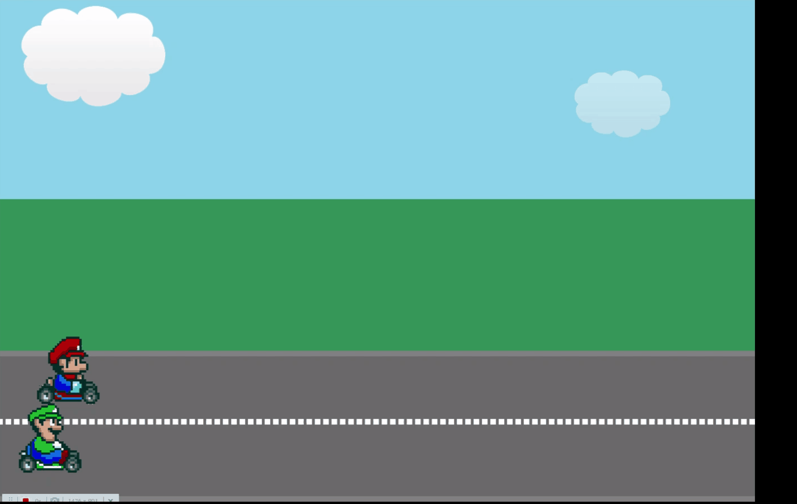

# Mario Kart Racing
This is a practice of creating animation with CSS & HTML.

Key elements used:

- `keyframes`
    - `from` & `to`
    - % of time
- `animation`
    - `animation-name`
        - apply one or multiple keyframes to an element
    - `animation-duration`
        - timespan of the animation
    - `animation-fill-mode`
        - backwards/forwards/both
    - `animation-iteration-count`
        - how many times the animation repeats
    - `animation-timing-function`  
        - ease/ linear/ etc.

## Demo

